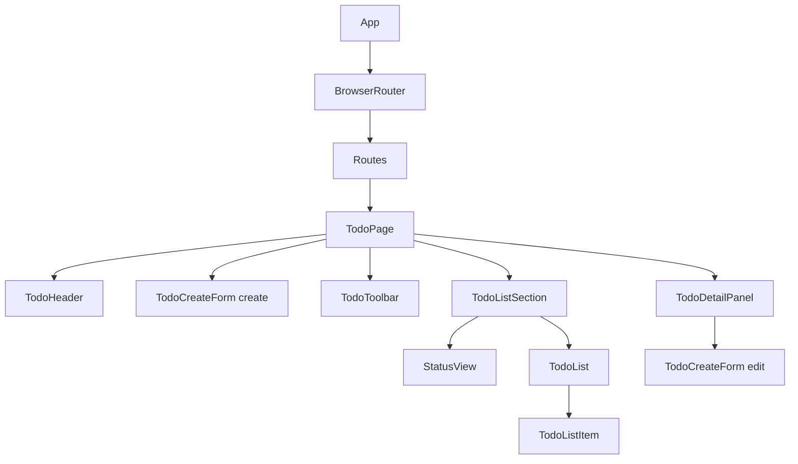
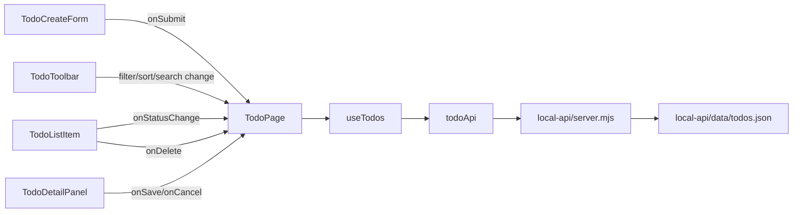
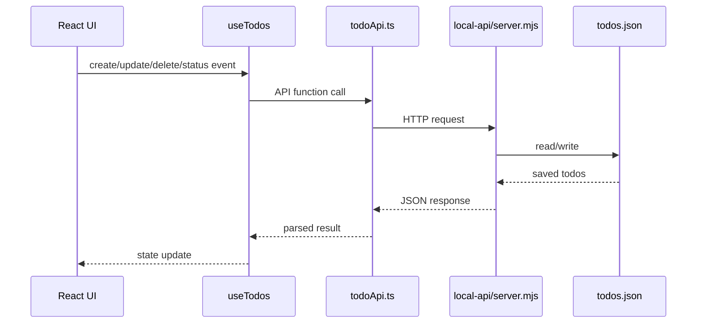
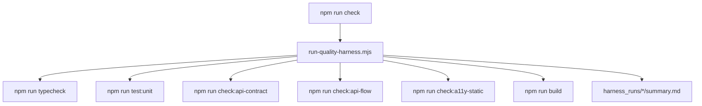

# コンポーネント関係マップ

このファイルは、UI、状態、API、保存、品質ハーネスの関係を辿るための管理ドキュメントです。

## 1. UI の包含関係

チェック:
- [x] `TodoPage` が主要 UI の親になっている。
- [x] `TodoListSection` が表示状態を切り替えている。
- [x] `TodoDetailPanel` が編集時に `TodoCreateForm` を再利用している。
- [ ] 作成用と編集用の `TodoCreateForm` 再利用が分かりやすいか確認する。

## 2. 状態とイベントの流れ

チェック:
- [x] 小さい UI 部品は API を直接叩かない。
- [x] UI イベントは `TodoPage` 経由で `useTodos` へ渡る。
- [x] API 通信は `todoApi.ts` にまとまっている。
- [x] 保存先は `todos.json` に限定している。
- [ ] API エラー時の復旧導線を画面で確認する。

## 3. API と保存の関係

チェック:
- [x] `GET /api/todos` がある。
- [x] `POST /api/todos` がある。
- [x] `PATCH /api/todos/:id` がある。
- [x] `PATCH /api/todos/:id/status` がある。
- [x] `DELETE /api/todos/:id` がある。
- [x] `check-api-flow.mjs` で作成、更新、完了、削除を確認している。

## 4. 品質ハーネスの関係

チェック:
- [x] 品質チェックを 1 コマンドで実行できる。
- [x] 結果を `harness_runs/` に保存する。
- [x] API フロー確認はテスト後に `todos.json` を元に戻す。
- [ ] Playwright による実ブラウザ確認を追加する。
- [ ] 実ブラウザ a11y 確認を追加する。

## 5. 依存方向のルール

- UI は hook を呼んでよい。
- hook は API client を呼んでよい。
- API client は HTTP だけを扱う。
- local API は JSON 保存だけを扱う。
- 小さい UI コンポーネントは API client を直接呼ばない。

違反チェック:
- [x] `components/` から `todoApi.ts` を直接 import していない。
- [x] `TodoPage` だけが `useTodos` を呼んでいる。
- [ ] 依存方向チェックを自動化する。
