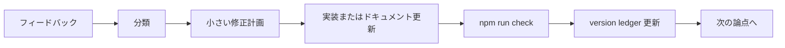

# フィードバック改善ワークストリーム

このファイルは、ツッコミ、修正、品質方針変更を小さく回すための管理ドキュメントです。

## 1. 基本方針

- フィードバックは、すぐ実装修正に入らず、まず分類する。
- 変更は小さく分ける。
- 各変更は、品質チェックとバージョン台帳へつなげる。

## 2. 分類

| 種別 | 例 | 置き場所 |
|---|---|---|
| UI 指摘 | 表示、導線、コンポーネント責任 | `component-purpose-checklist.md` |
| 関係性指摘 | 依存、包含、event、API 接続 | `component-relation-map.md` |
| 汎用性指摘 | 専用すぎる、切り出せる | `genericity-review.md` |
| 品質指摘 | チェック不足、証跡不足 | `quality-management-plan.md` |
| バージョン指摘 | どの版の話か不明 | `artifact-version-ledger.md` |

## 3. 改善ループ



## 4. フィードバック記録フォーマット

```markdown
## YYYY-MM-DD: タイトル

- 対象バージョン:
- 種別:
- 指摘:
- 事実:
- 影響:
- 修正方針:
- 品質確認:
- 次の一手:
```

## 5. 現在の次候補

優先度とおすすめ度は 5 が高い。

| 項目 | 種別 | 優先度 | おすすめ度 | 根拠 |
|---|---|---:|---:|---|
| 実ブラウザ E2E 追加 | 品質 | 5 | 5 | 画面操作がまだ自動確認できていない |
| 実ブラウザ a11y 追加 | 品質 | 5 | 5 | 静的 a11y だけでは弱い |
| ハーネス設定の外出し | 汎用性 | 3 | 4 | 別アプリへ流用しやすくなる |
| UI 目的チェックの自動化 | 品質 | 3 | 3 | まずは手動レビューで十分 |
