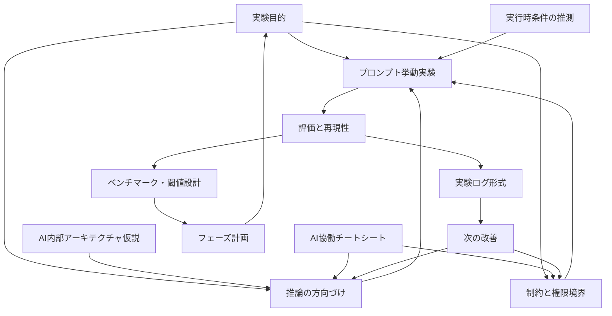

# AI 実験スコープ整理

このディレクトリは、AIの挙動やハーネス設計を大枠ごとに分けて調査するための置き場です。

## 1. 結論

まずは次の9領域に分ける。

| 領域 | ディレクトリ | 役割 |
|---|---|---|
| AI内部アーキテクチャ仮説 | `architecture_decomposition/` | AIの入力、文脈、推論、tool実行、出力を仮説として分解する |
| 実行時条件の推測 | `runtime_context_assumptions/` | モデル、バージョン、割当リソース、動作パラメータなどを観測可能な範囲で記録する |
| 推論の方向づけ | `inference_direction_design/` | プロンプトで何を重視させるかを整理する |
| プロンプト挙動実験 | `prompt_behavior_experiments/` | 個別プロンプトを作り、出力差分を比較する |
| 評価と再現性 | `evaluation_reproducibility/` | 実験結果を比較できる形にする |
| ベンチマーク・閾値設計 | `benchmark_threshold_design/` | 対象ごとの評価軸、閾値、版管理、測定結果を分けて管理する |
| 制約と権限境界 | `constraint_permission_boundaries/` | AIに渡す権限、禁止事項、確認条件を整理する |
| 実験ログ形式 | `experiment_log_schema/` | 実験ごとの記録形式をそろえる |
| フェーズ計画 | `phase_plan/` | 次に何を試し、どこまでできたら区切るかを管理する |
| AI協働チートシート | `ai_collaboration_cheatsheet/` | AIが分からない時やズレそうな時に、どう動き、どうボールをパスするかを管理する |

各スコープで実際に試した記録は、原則として各ディレクトリ配下の `experiments/` に置く。

## 2. 関係図

## 3. 注意

- AIの内部学習セット、割当リソース、内部パラメータは通常こちらから直接見えない。
- そのため、ここでは `事実として観測できたもの` と `挙動からの推測` を分ける。
- SNSや一般論より、同じ入力で再実行した結果、差分、再現性を優先する。

## 4. 将来の置き場所見直し

現時点では、README中心の前準備なので `internal_refs/ai_experiment_scopes/` に置く。

ただし、次のような実体を多く持ち始めたら、参考資料ではなく実験基盤として扱う。

- 実験データ。
- 複数モデル比較。
- グラフ。
- 定量評価。
- 実験用コード。
- corpus。
- automated experiment runner。

その段階では、root-level の `experiments/`、`research/`、`ai_behavior_lab/` などへ昇格することを検討する。

今は移動しない。理由は、まだ前準備の段階であり、早く動かすと管理コストが増えるため。

## 5. 追加した方がよい候補

優先度とおすすめ度は5が高い。ここでの優先度は `後で実験を再開し、比較できる基盤を作る視点` で見る。

| 候補 | 優先度 | おすすめ度 | 背景 |
|---|---:|---:|---|
| 実験ログ形式の固定 | 5 | 5 | 同じ実験を比較できないと、改善したか判断しにくい |
| 評価指標の固定 | 5 | 5 | 出力が良いか悪いかを感覚だけで判断しないため |
| 制約と権限境界の記録 | 4 | 5 | tool実行やファイル編集の事故を避けるため |
| 比較用プロンプトの保存 | 4 | 4 | 良いプロンプトだけでなく、弱いプロンプトとの差分を見るため |
| 人間のレビューコスト記録 | 4 | 4 | AIで効率化できたかを時間や修正回数で見るため |
