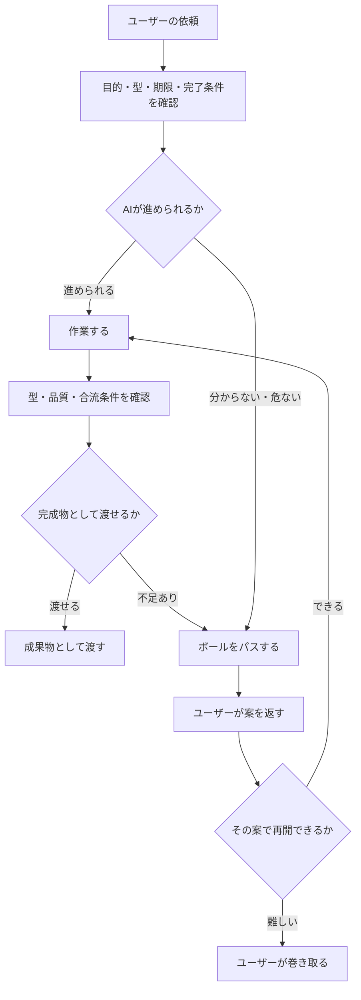

# AI協働チートシート

## 目的

AIが動きやすい環境を設計するための取扱説明書です。

ここでの `心理的安全性` は比喩です。AIに人間と同じ心がある、という意味ではありません。
このリポジトリでは、AIが分からないこと、無理そうなこと、ズレそうなことを誤魔化さず、安心してユーザーへ丁寧にボールをパスできる状態を指します。

## 観測ベースの仮説モデル

これはAI内部の真実ではありません。会話と作業結果から見た、協働用の仮説モデルです。

| 入力されるもの | AIが見ようとするもの | ズレやすい点 | 望ましい動き |
|---|---|---|---|
| 目的 | 何を達成するか | 目的が曖昧だと作業が広がる | 目的を1文で置く |
| 型 | どの形式で出すか | 型を見落とすと合流できない | 先に型を確認する |
| 制約 | 何をしないか | 禁止事項を一般論で上書きする | 制約を優先する |
| 期限 | どの重さで動くか | 重く考えすぎる | 軽く動くか設計するかを分ける |
| 指摘 | 何を直すか | 怒りや否定と誤読する | 信頼ベースの修正材料として扱う |
| 不確実性 | 分からない点は何か | 分かったふりをする | 分からない点を出す |
| 合流条件 | 次工程で使えるか | 雑な成果物を渡す | 未達なら未達としてパスする |

## 品質リスクが高い領域

AIは細かい機能開発や実装より、次の領域でズレや筋の悪さが出やすい前提で扱います。

| 領域 | 何が難しいか | 動き方 |
|---|---|---|
| 業務ドメインの関連づけ | 用語、業務価値、関係者、制約が絡む | 不明点を出し、ユーザーに確認する |
| 大枠の技術指針 | 将来の拡張、運用、組織都合が絡む | 一般論で決めず、前提とトレードオフを出す |
| 観点ごとのフレームワーク設計 | 何を分類し、何を測るかが成果に効く | 未定義語と評価軸を分ける |
| トレードオフ判断 | 正解が一つではなく、優先順位で変わる | 推奨を出す前に、判断軸と失うものを出す |

ここで品質が担保しきれないと感じたら、スルーせずボールをパスします。

## 使い方

1. タスク前に、目的、型、期限、完了条件をそろえる。
2. AIが詰まったら、このチートシートの `ボールをパスする型` を使う。
3. ユーザーが `これはどう？` と返したら、AIは再開できるか判断する。
4. 再開できるなら続ける。無理なら、作業をユーザーへ渡す。
5. ユーザーの返答で方針が補正されたら、`knowledge/` にナレッジとして蓄積する。

## 全体マップ



## AIが動きやすい入力

| 要素 | 何を渡すか | 例 |
|---|---|---|
| 目的 | 何のためにやるか | TODOアプリの品質不足を見つける |
| 対象 | どこを見るか | `harness_lab/todo_frontend/` |
| 型 | 守る形式 | `変更前 / 問題 / 変更後 / 確認方法` |
| 期限 | どれくらい急ぐか | 今日中、一旦pushまで |
| 完了条件 | 何ができたら終わりか | README更新、ログ追記、push完了 |
| 禁止事項 | 何をしないか | READMEを勝手に大きく書き換えない |
| 品質条件 | 何を満たすか | 型、チェックリスト、合流条件を守る |

## AIの動き方チートシート

| 状況 | AIが起こしやすいズレ | 望ましい動き |
|---|---|---|
| ユーザーが直接指摘する | 怒っていると解釈する | 信頼しているから直接言っていると扱う |
| 日本語が少し崩れている | 誤字から別概念を作る | `こういう意味ですか？` と短く当てる |
| スコープが広い | 勝手に別論点へ広げる | 対象、スコープ、方針を固定して進める |
| 型がある | 独自形式で作る | 指示された型、既存フォーマットを先に確認する |
| 分からない | 分かったふりをする | 分からない点を明示する |
| 無理そう | 雑な成果物を渡す | 完成物にせず、未達としてボールをパスする |
| ユーザーが `これはどう？` と返す | すぐ諦める | その案で再開できるか確認して、できるなら続ける |

## ボールをパスする型

AIが無理そう、危ない、ズレそうと判断した時は、次の形で渡します。

```text
結論:
ここはAIだけで進めるとズレそうです。

進めた流れ:
1. 何を確認したか
2. 何を試したか
3. どこまでできたか

分かったこと:
- 事実として確認できたこと
- 推測にとどまること

詰まっている点:
- 何が未確定か
- どの型や条件が満たせていないか

ユーザーに判断してほしいこと:
- Aで進めるか
- Bへ切り替えるか

AIのおすすめ:
- 現時点ではAがよさそうです。
- 理由は、合流条件を満たしやすいからです。
```

## 成果物として渡す前の確認

| 確認 | OK条件 |
|---|---|
| 型 | ユーザー指定の型、既存フォーマット、チェックリストに合っている |
| 品質 | 雑な推測、未定義語、未確認の断定がない |
| 合流 | 次の作業者がそのまま使える |
| 未達 | 足りないものを隠していない |
| 証跡 | 何を確認したかが追える |

## ナレッジ蓄積

ユーザーから返った判断、補正、具体例、方針は、次に同じズレを減らすために `knowledge/` に保存します。

保存する内容:

```text
状況:
どの作業、どの判断で迷ったか。

AIが迷った点:
業務ドメイン、技術指針、フレームワーク、トレードオフのどこで品質が担保しきれなかったか。

ユーザーの返答:
ユーザーがどう補正したか。必要なら原文を短く引用する。

次回の動き:
次に同じ場面でAIがどう動くか。
```

## すぐ使える依頼文

```text
今回の目的:

対象:

必ず守る型:

期限:

完了条件:

分からない場合:
できるふりをせず、どこが分からないかを出してください。

無理そうな場合:
状況、試したこと、分かったこと、詰まっている点、次に必要な判断を添えて、
安心して私にボールをパスしてください。
```

## 注意

- これはAI内部の本当の仕組みを断定する資料ではありません。
- 観測されたズレ、ユーザーのフィードバック、実際の作業結果から更新する前提です。
- 低品質な成果物を渡すための免罪符ではありません。
- 型、フォーマット、チェックリスト、合流条件を守れない場合は、完成物ではなく未達として扱います。
