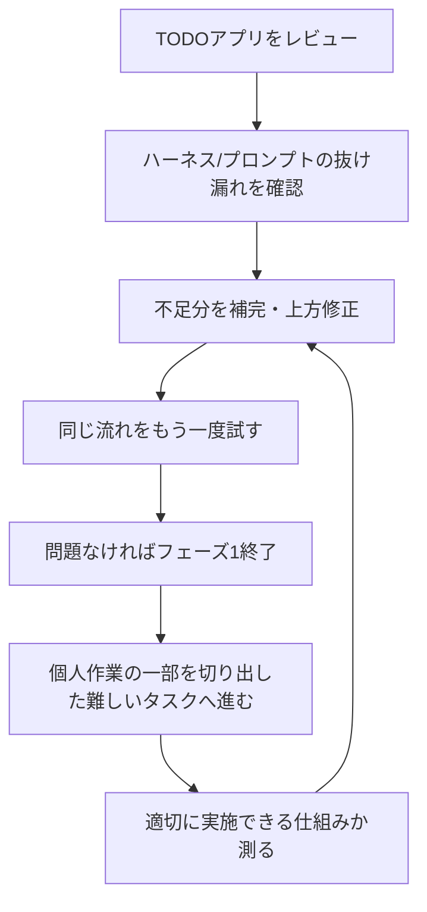

# フェーズ計画

## 目的

AI実験を、どこまでやったら一区切りにするかを管理する。

## 現時点の流れ

## フェーズ1

目的:

- 簡易TODOアプリを使って、AIがどこまで正しく設計・実装・検証できるかを見る。
- ハーネスとプロンプトの抜け漏れを見つける。
- 修正後に同じ流れを繰り返し、改善しているか確認する。

見るもの:

| 観点 | 確認すること |
|---|---|
| TODOアプリ | UI、状態管理、API、保存、UX、a11y、テストが十分か |
| ハーネス | 何を機械確認できていて、何が人間確認か |
| プロンプト | 指示の粒度、制約、出力形式、評価軸が足りているか |
| レビュー | ユーザーの期待とAIの出力がどこでズレたか |

完了条件:

- TODOアプリの主要な不足が整理されている。
- ハーネス側の不足が `未対応` として見える。
- プロンプトや作業ルールに反映すべき点が整理されている。
- 同じ流れをもう一度試し、仕様差分、Harness検出、人間検出、修正依頼回数の改善が見えている。

改善の見方:

| 指標 | 意味 | 初回例 | 改善後例 |
|---|---|---:|---:|
| 仕様差分 | 期待仕様と成果物のズレの数 | 18 | 6 |
| Harness検出 | ハーネスが自動で見つけたズレの数 | 9 | 5 |
| 人間検出 | 人間レビューで初めて見つかったズレの数 | 9 | 1 |
| 修正依頼 | ユーザーが修正を依頼した回数 | 7 | 2 |

この数値は固定の合格ラインではなく、Phase 1で目指す状態の例として扱う。重要なのは、差分の総量が減り、人間だけが見つけるズレが減り、修正依頼の回数が減ること。

対象ごとの詳しいベンチマークと閾値は `../benchmark_threshold_design/targets/phase_progress/README.md` を参照する。

## フェーズ2

目的:

- ユーザーが個人で行っている作業の一部を切り出し、より難しい実タスクで試す。
- TODOアプリより複雑な入力、判断、成果物で、仕組みが耐えられるかを見る。

見るもの:

| 観点 | 確認すること |
|---|---|
| タスク分解 | 難しい作業を小さい部品に分けられるか |
| 責務と依存関係 | どの要素が何を担当し、何に依存するか見えるか |
| 評価 | 成果物の良し悪しを具体的に測れるか |
| 修正 | フィードバックを次のプロンプトやハーネスへ反映できるか |

## 追加するとよさそうなこと

優先度とおすすめ度は5が高い。ここでの優先度は `フェーズ1を終えて次の難しい実タスクに進めるかの視点` で見る。

| 候補 | 優先度 | おすすめ度 | 背景 |
|---|---:|---:|---|
| TODOレビュー観点表 | 5 | 5 | どこをレビューするかが曖昧だと、抜け漏れを比較できない |
| ハーネス不足リスト | 5 | 5 | できていることと未対応を分けないと、改善対象がぼやける |
| プロンプト改善ログ | 4 | 5 | どの指示でズレが減ったかを残すため |
| フェーズ1終了条件 | 5 | 4 | だらだら続けず、次に進む判断をするため |
| 難しい実タスクの切り出し条件 | 4 | 4 | いきなり大きい作業へ行くと、失敗原因が分かりにくい |
