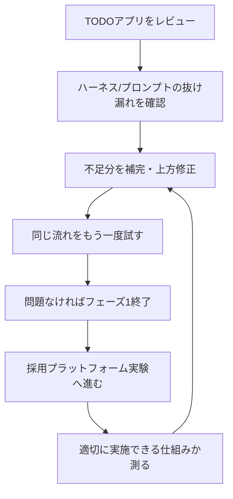

# フェーズ計画

## 目的

AI実験を、どこまでやったら一区切りにするかを管理する。

## 現時点の流れ

次回の具体タスク:

- [次回することリスト 2026-08-28 / 2026-08-29](next-action-checklist-2026-08-28-29.md)

## フェーズ1

目的:

- 簡易TODOアプリを使って、AIがどこまで正しく設計・実装・検証できるかを見る。
- ハーネスとプロンプトの抜け漏れを見つける。
- 修正後に同じ流れを繰り返し、改善しているか確認する。

見るもの:

| 観点 | 確認すること |
|---|---|
| TODOアプリ | UI、状態管理、API、保存、UX、a11y、テストが十分か |
| ハーネス | 何を機械確認できていて、何が人間確認か |
| プロンプト | 指示の粒度、制約、出力形式、評価軸が足りているか |
| レビュー | ユーザーの期待とAIの出力がどこでズレたか |

完了条件:

- TODOアプリの主要な不足が整理されている。
- ハーネス側の不足が `未対応` として見える。
- プロンプトや作業ルールに反映すべき点が整理されている。
- 同じ流れをもう一度試し、仕様差分、Harness検出、人間検出、修正依頼回数の改善が見えている。
- `以前: 修正5回、3時間` から `改善後: 修正1回、45分、品質条件100%通過` のような改善履歴を記録できる状態になっている。

改善の見方:

| 指標 | 意味 | 初回例 | 改善後例 |
|---|---|---:|---:|
| 仕様差分 | 期待仕様と成果物のズレの数 | 18 | 6 |
| Harness検出 | ハーネスが自動で見つけたズレの数 | 9 | 5 |
| 人間検出 | 人間レビューで初めて見つかったズレの数 | 9 | 1 |
| 修正依頼 | ユーザーが修正を依頼した回数 | 7 | 2 |

この数値は固定の合格ラインではなく、Phase 1で目指す状態の例として扱う。重要なのは、差分の総量が減り、人間だけが見つけるズレが減り、修正依頼の回数が減ること。

対象ごとの詳しいベンチマークと閾値は `../benchmark_threshold_design/targets/phase_progress/README.md` を参照する。

Harness改善が実作業に効いたかは `../benchmark_threshold_design/targets/harness_effectiveness/README.md` と `../benchmark_threshold_design/experiments/harness_effectiveness/` に分けて記録する。

## フェーズ2

目的:

- 個人サービスや個人ツールの一部切り出しの代わりに、採用プラットフォームを実験場にする。
- TODOアプリより複雑な入力、判断、状態遷移、権限、業務フローで、仕組みが耐えられるかを見る。
- SmartHR Design System などを参照し、デザインパターンの学習とハーネス構築を同時に進める。

見るもの:

| 観点 | 確認すること |
|---|---|
| 業務フロー | 求人、候補者、応募、面接、評価、内定などを分けられるか |
| UIパターン | 一覧、詳細、フォーム、フィードバック、権限表示を整理できるか |
| 責務と依存関係 | UI、状態、API、保存、権限、ログの関係が見えるか |
| 評価 | 成果物の良し悪しを具体的に測れるか |
| ハーネス | 状態遷移、API契約、UI操作、a11y、依存関係を機械確認できるか |
| 修正 | フィードバックを次のプロンプトやハーネスへ反映できるか |

進め方:

1. TODOアプリのレビューと不足整理を終える。
2. 採用プラットフォームMVPの範囲を決める。
3. 外部参照を読み、業務フロー、UIパターン、品質観点を抽出する。
4. 実装前に、責務、依存関係、状態遷移、API契約、ハーネス対象を整理する。
5. 小さく実装し、ハーネスで確認する。
6. 人間レビューとの差分、修正回数、所要時間、品質条件通過率を記録する。

参照:

- `../../../external_refs/harness_recruiting_platform_references/README.md`
- `../benchmark_threshold_design/targets/harness_effectiveness/README.md`

非ゴール:

- SmartHR Design System を正解として固定しない。
- 採用プラットフォームをすぐ実サービス化することを目的にしない。
- 個人サービスや個人ツールの内部情報を、不要に持ち込まない。

## 追加するとよさそうなこと

優先度とおすすめ度は5が高い。ここでの優先度は `フェーズ1を終えて次の難しい実タスクに進めるかの視点` で見る。

| 候補 | 優先度 | おすすめ度 | 背景 |
|---|---:|---:|---|
| TODOレビュー観点表 | 5 | 5 | どこをレビューするかが曖昧だと、抜け漏れを比較できない |
| ハーネス不足リスト | 5 | 5 | できていることと未対応を分けないと、改善対象がぼやける |
| プロンプト改善ログ | 4 | 5 | どの指示でズレが減ったかを残すため |
| フェーズ1終了条件 | 5 | 4 | だらだら続けず、次に進む判断をするため |
| 採用プラットフォームMVP設計 | 5 | 5 | フェーズ2の実験対象になるため |
| 外部参照の読み込み順 | 4 | 4 | 参照先が多いと、学習対象と実装対象が混ざりやすいため |
