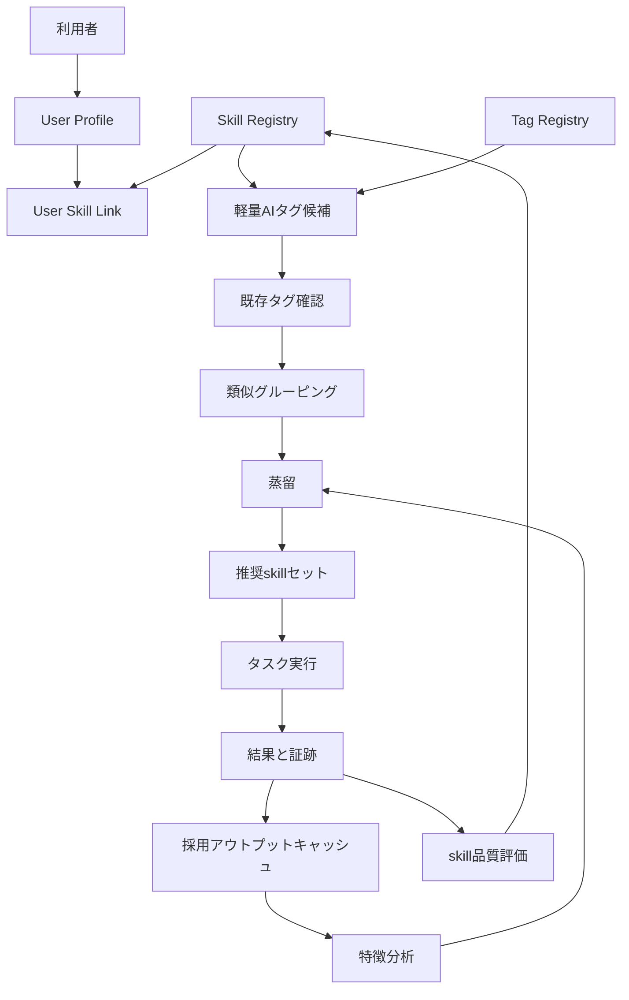

# チーム一元化ハーネス 詳細設計ドラフト

## 1. 結論

チームハーネスは、標準の Codex / Claude や単一層のplanningだけに任せない。

利用者ID、skill、タグ、品質評価、グルーピング、蒸留を分けて管理し、チームで使っても個人差と品質差を扱える仕組みにする。

## 2. 目的

- 個人に合う / 合わないを前提として扱う。
- 利用者ごとに、合いやすいskillや進め方を持てるようにする。
- 類似する情報をタグで束ね、探しやすくする。
- skillの強さやアウトプット品質を見て、使う候補を推奨できるようにする。
- グループ化した情報を整理し、洗練させる。ここではこの工程を `蒸留` と呼ぶ。
- 情報が増えても、ノイズや意図の歪みで品質が落ちにくい状態にする。

## 3. 非ゴール

- まだ実装しない。
- まだAIチェックを実行しない。
- まだ active skill は増やさない。
- まだ Codex / Claude の内蔵planningへ直接連携しない。
- タグや評価を、人への評価として扱わない。
- 利用者の個人差を、良し悪しの判定にしない。

## 4. 解きたい問題

| 問題 | 困ること | この設計での対策 |
|---|---|---|
| 個人差 | ある人に合う手順が、別の人には合わない | userId と skill / preference を紐づける |
| skill増加 | skillが増えて衝突し、読みすぎる | タグ、状態、優先順位で読む候補を絞る |
| タグ乱立 | 似たタグが増えて探せなくなる | 生成前に既存タグを確認する |
| 品質差 | skillごとに出力の強さが違う | 10段階で品質と適合度を記録する |
| 情報の重複 | 似た判断や質問が散らばる | 一定条件でグルーピングする |
| 情報の粗さ | まとめただけで使いにくい | 蒸留して、短く使える形にする |

## 5. 全体像



## 6. 主要部品

| 部品 | 役割 | 持つ情報 |
|---|---|---|
| User Profile | 利用者ごとの前提を持つ | userId、職種、好む粒度、苦手な進め方 |
| Skill Registry | skill本体の台帳 | skillId、目的、発火条件、非発火条件 |
| User Skill Link | 利用者とskillの相性を持つ | userId、skillId、推奨度、使う場面 |
| Tag Registry | タグの正本 | tagId、名前、意味、類似語、作成理由 |
| Tag Checker | 既存タグの確認 | 新規タグ候補、既存タグとの一致 |
| Grouping | 似た情報を束ねる | 共通タグ、対象、観点、一致数 |
| Distillation | 束ねた情報を洗練する | 残す内容、削る内容、例外、次版 |
| Skill Score | skillの強さを見る | 適合度、出力品質、再現性、保守性 |
| Adopted Output Cache | 採用されたアウトプットを蓄積する | 採用理由、特徴、修正過程、差分 |

## 7. データ構造案

### 7.1 User Profile

```json
{
  "schemaVersion": "team-harness-user-profile.v1",
  "userId": "user-001",
  "role": "engineer",
  "preferredOutput": {
    "length": "short",
    "style": "conclusion-first",
    "examples": "required-when-abstract"
  },
  "avoid": [
    "undefined abstract words",
    "unrequested scope expansion"
  ]
}
```

### 7.2 Skill Registry

```json
{
  "schemaVersion": "team-harness-skill-registry.v1",
  "skills": [
    {
      "skillId": "alignment-gap-review",
      "purpose": "期待ズレ、観点ズレ、対象ズレを確認する",
      "triggerTags": ["alignment-gap", "design-review", "viewpoint-gap"],
      "nonTriggerTags": ["runtime-start-stop"],
      "status": "active"
    }
  ]
}
```

### 7.3 User Skill Link

```json
{
  "schemaVersion": "team-harness-user-skill-link.v1",
  "links": [
    {
      "userId": "user-001",
      "skillId": "alignment-gap-review",
      "fitScore": 9,
      "recommendedUse": ["設計相談", "レビュー前確認"],
      "note": "提供価値、対象、観点のズレ確認に合う"
    }
  ]
}
```

### 7.4 Tag Registry

```json
{
  "schemaVersion": "team-harness-tag-registry.v1",
  "tags": [
    {
      "tagId": "viewpoint-gap",
      "label": "観点ズレ",
      "meaning": "同じ対象をどの見方で扱っているかが違う",
      "aliases": ["information-space-gap", "見方のズレ"],
      "examples": [
        "ユーザー情報をDB列として見るか、権限や監査まで含めて見るか"
      ],
      "status": "active"
    }
  ]
}
```

## 8. タグ生成前チェック

新しいタグを作る前に、必ず既存タグを見る。

```text
1. 入力文を読む
2. 軽量AIチェックでタグ候補を出す
3. Tag Registry を検索する
4. 既存タグで意味が近いものがあれば、それを使う
5. 既存タグで足りない場合だけ新規タグ候補にする
6. 新規タグは、意味、使い所、似たタグとの差分を持つ
```

仮ルール:

| 条件 | 扱い |
|---|---|
| 既存タグと意味がほぼ同じ | 既存タグを使う |
| 既存タグと一部だけ重なる | aliases または relatedTags に入れる |
| 既存タグで表せない | new-tag-candidate にする |
| confidence < 0.75 | 自動採用しない |

## 9. グルーピング

類似タグや内容が一定以上一致したものは、グループ化する。

仮ルール:

| 条件 | 扱い |
|---|---|
| 共通タグが3個以上 | 同じgroup候補 |
| 対象scopeが同じで、観点タグが2個以上一致 | 同じgroup候補 |
| userIdだけが違い、目的と観点が同じ | user差分ありのgroup候補 |
| 出力品質が低いものが混ざる | そのまま統合せず、蒸留時に分ける |

サンプル:

```json
{
  "schemaVersion": "team-harness-group.v1",
  "groupId": "group-design-alignment-001",
  "tags": ["alignment-gap", "viewpoint-gap", "design-review"],
  "members": [
    "alignment-gap-review",
    "design-traceability-framework"
  ],
  "reason": "設計レビュー時のズレ確認で使う要素が重なる"
}
```

## 10. skillの強さと品質評価

10段階で見る。10が高い。

| 評価軸 | 意味 |
|---|---|
| fitScore | その利用者やタスクに合うか |
| outputQuality | 出力が使える形か |
| triggerAccuracy | 必要な時に発火し、不要な時に発火しないか |
| noiseControl | ノイズや余計な推論を増やさないか |
| maintenanceScore | 更新しやすく、古くなりにくいか |

サンプル:

```json
{
  "skillId": "alignment-gap-review",
  "taskType": "design-review",
  "scores": {
    "fitScore": 9,
    "outputQuality": 8,
    "triggerAccuracy": 8,
    "noiseControl": 7,
    "maintenanceScore": 8
  },
  "recommendation": "recommended"
}
```

## 11. 蒸留

ここでの `蒸留` は、特殊な使い方として扱う。

意味:

- 似た情報をただまとめるだけではない。
- 重複を減らす。
- 大事な差分は残す。
- 使える質問、判断軸、NG例、OK例に洗練する。
- 次回のチーム作業で短く使える形にする。

蒸留の手順:

```text
1. groupを選ぶ
2. membersを読む
3. 重複を消す
4. 差分を残す
5. user差分を分ける
6. NG例 / OK例を作る
7. 次版として保存する
8. 実タスクで使って効果を見る
```

蒸留後のサンプル:

```json
{
  "schemaVersion": "team-harness-distilled-sheet.v1",
  "sheetId": "distilled-design-alignment-001",
  "sourceGroupId": "group-design-alignment-001",
  "coreQuestions": [
    "誰に何の価値を出すか",
    "同じ言葉をどの情報空間で見ているか",
    "対象scopeと完了条件は合っているか"
  ],
  "ngExamples": [
    "README修正の話から勝手にアプリ実装へ進む"
  ],
  "okExamples": [
    "対象、観点、次の一手を分けてから進む"
  ],
  "version": "0.1.0"
}
```

## 12. 推奨の流れ

```text
1. userIdを確認する
2. taskTypeを確認する
3. タグ候補を出す
4. 既存タグを確認する
5. skill候補を出す
6. userIdとの相性を見る
7. skill品質スコアを見る
8. 推奨skillセットを作る
9. ステートごとに読むskill順序を決める
10. 実行後に結果と証跡を保存する
11. 一定件数たまったら蒸留する
```

## 13. 推奨出力

```text
結論:
このタスクでは、alignment-gap-review と design-traceability-framework を先に使う。

理由:
- user-001 は、提供価値、観点、対象のズレ確認を重視する。
- taskType が design-review。
- 共通タグが alignment-gap / viewpoint-gap / design-review。

読まないskill:
- app-runtime-operations-governance
  理由: まだ起動やloggerの話ではない。

次の一手:
対象scope、flow、typeModelRefを置き、観点ごとのチェック表を作る。
```

## 14. 受け入れ条件

詳細設計レビューの完了条件:

- [ ] userId と skill の紐づき方が分かる。
- [ ] tag作成前の既存チェックがある。
- [ ] 類似タグと内容のグルーピング条件がある。
- [ ] skillの強さや品質を10段階で見られる。
- [ ] 蒸留の意味と手順が分かる。
- [ ] 個人差を、人の評価として扱わないことが明記されている。
- [ ] Codex / Claude の内蔵planningへ未検証で連携しないことが明記されている。

ユーザーOK後の最小PoC候補:

- [ ] tag registry sampleを作る。
- [ ] user skill link sampleを作る。
- [ ] skill score sampleを作る。
- [ ] 既存タグ確認runnerを作る。
- [ ] group候補を出すrunnerを作る。
- [ ] 蒸留シートの手動ドラフトを1つ作る。

## 15. 注意

- タグは便利だが、増やしすぎるとノイズになる。
- AIの軽量チェックは、候補生成までに留める。
- confidenceが低いタグやグループは、自動採用しない。
- 人間の個人差を、優劣として扱わない。
- チーム標準は必要だが、個人差を消すものにしない。
- 蒸留では、少数ケースや特殊ケースを雑に消さない。

## 16. 採用アウトプットキャッシュ

将来の展望として、良かったアウトプットはキャッシュする。

ここでのキャッシュは、AIが一度出したものをそのまま保存して再利用することではない。

人とAIが協業し、最終的に採用されたアウトプットを対象にする。

保存するもの:

| 項目 | 内容 |
|---|---|
| 採用アウトプット | 最終的に使うと決めた成果物 |
| 採用理由 | なぜ採用したか |
| 初期案 | 最初のAI出力や人間案 |
| 修正過程 | どこにフィードバックが入り、どう直ったか |
| 変化した特徴 | 何がどう良くなったか |
| 使える条件 | どんなタスク、利用者、チームで再利用できるか |
| 注意点 | そのまま使うと危ない条件 |

サンプル:

```json
{
  "schemaVersion": "team-harness-adopted-output-cache.v1",
  "cacheId": "accepted-output-001",
  "taskType": "design-review",
  "source": {
    "userId": "user-001",
    "skillIds": ["alignment-gap-review"],
    "tags": ["viewpoint-gap", "design-review"]
  },
  "adoptedOutput": "対象、観点、次の一手を分けてから進む",
  "adoptionReason": "ユーザーの意図を歪めず、次の行動に接続できたため",
  "improvementTrace": [
    {
      "before": "抽象的にズレを説明した",
      "feedback": "具体例と次の行動まで結びたい",
      "after": "未定義語、ダメな文、使える文、次の行動に分けた"
    }
  ],
  "featureChanges": [
    {
      "feature": "具体性",
      "before": "抽象語が多い",
      "after": "具体例と判定条件がある"
    },
    {
      "feature": "行動接続",
      "before": "説明で止まる",
      "after": "次の一手まで出る"
    }
  ],
  "reuseCondition": "設計相談やレビューで、ユーザー意図とAI出力のズレを確認する時",
  "warnings": [
    "別タスクへそのまま貼らない",
    "利用者やチームの前提が違う場合は再確認する"
  ],
  "version": "0.1.0"
}
```

この仕組みで見たいこと:

- どの出力が採用されたか。
- なぜ採用されたか。
- どのフィードバックで良くなったか。
- 良くなった特徴は何か。
- 別チームや別タスクで再利用できるか。

まだ実装しない。

まずは設計上の将来展望として置き、チームハーネスの蒸留プロセスと接続する。
