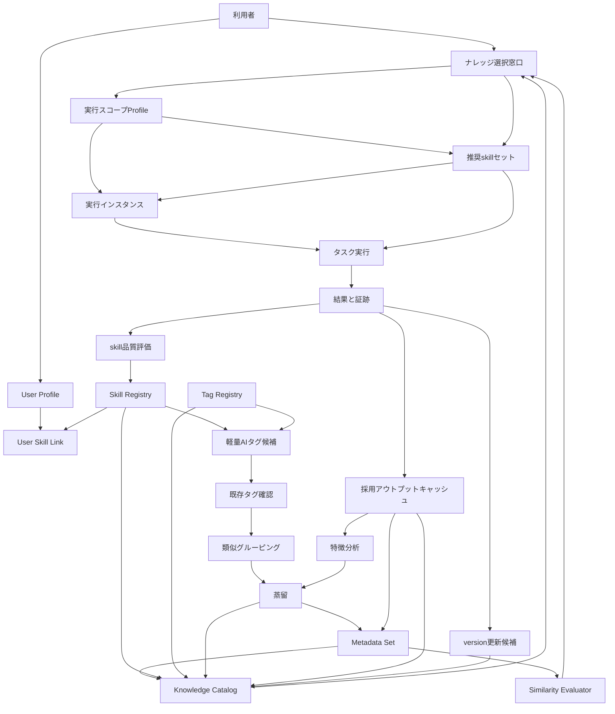

# チーム一元化ハーネス 詳細設計ドラフト

## 1. 結論

チームハーネスは、標準の Codex / Claude や単一層のplanningだけに任せない。

利用者ID、skill、タグ、品質評価、グルーピング、蒸留を分けて管理し、チームで使っても個人差と品質差を扱える仕組みにする。

ただし、チーム版でハーネス内部のナレッジを毎回全部読ませると重くなる。ユーザーの窓口として、一覧表から必要なナレッジだけを選び、タスクやスコープごとに切り替えられる層を置く。

利用者側は、裏側の複雑な仕組みを意識しなくてよい状態を目指す。例として、`今回DB設計` を選ぶと推奨セットが出て、利用者は2つほど選び、作業中に必要なら1つ追加するくらいの軽さにする。

この設計の価値は、業務速度の改善だけではない。暗黙知、チートシート、再利用できる実装モジュール、検索用メタ情報、品質チェック機構を対象に関連づけ、必要な範囲だけ取り出して使えるようにすることも中心価値として扱う。

## 2. 目的

- 個人に合う / 合わないを前提として扱う。
- 利用者ごとに、合いやすいskillや進め方を持てるようにする。
- 類似する情報をタグで束ね、探しやすくする。
- skillの強さやアウトプット品質を見て、使う候補を推奨できるようにする。
- グループ化した情報を整理し、洗練させる。ここではこの工程を `蒸留` と呼ぶ。
- 情報が増えても、ノイズや意図の歪みで品質が落ちにくい状態にする。
- 全ナレッジを常時読み込ませず、必要なものだけ選ぶ。
- タスク開始前、作業途中、スコープ変更時にナレッジセットを切り替えられるようにする。
- 速度と品質の両方を見て、生産性を最大化する。
- 利用者が仕組みを強く意識しなくても、必要なセットを選んで動けるようにする。
- 暗黙知やチートシートを、対象、観点、チェックリストに結びつける。
- 汎用的な実装開発モジュールや類似モジュールを蓄積し、再利用できるようにする。
- AIがその時々に必要な情報を探せるよう、本体情報と検索用メタ情報を関連づける。
- 品質チェックのツールや機構が、対象スコープだけを取り出して適用できるようにする。

## 3. 非ゴール

- まだ実装しない。
- まだAIチェックを実行しない。
- まだ active skill は増やさない。
- まだ Codex / Claude の内蔵planningへ直接連携しない。
- タグや評価を、人への評価として扱わない。
- 利用者の個人差を、良し悪しの判定にしない。
- ハーネス内部のナレッジを、毎回すべてAIへ渡さない。

## 4. 解きたい問題

| 問題 | 困ること | この設計での対策 |
|---|---|---|
| 個人差 | ある人に合う手順が、別の人には合わない | userId と skill / preference を紐づける |
| skill増加 | skillが増えて衝突し、読みすぎる | タグ、状態、優先順位で読む候補を絞る |
| タグ乱立 | 似たタグが増えて探せなくなる | 生成前に既存タグを確認する |
| 品質差 | skillごとに出力の強さが違う | 10段階で品質と適合度を記録する |
| 情報の重複 | 似た判断や質問が散らばる | 一定条件でグルーピングする |
| 情報の粗さ | まとめただけで使いにくい | 蒸留して、短く使える形にする |
| 常時読み込みの重さ | ナレッジが増えるほど遅くなり、ノイズも増える | 一覧表から使うものだけ選択する |
| スコープ切替 | タスクごとに必要な前提やskillが変わる | 実行スコープごとに選択セットを持つ |
| 利用者負荷 | 仕組みを理解しないと使えない | 軽い入口と推奨セットで迷いを減らす |

## 5. 全体像



## 6. 主要部品

| 部品 | 役割 | 持つ情報 |
|---|---|---|
| User Profile | 利用者ごとの前提を持つ | userId、職種、好む粒度、苦手な進め方 |
| Skill Registry | skill本体の台帳 | skillId、目的、発火条件、非発火条件 |
| User Skill Link | 利用者とskillの相性を持つ | userId、skillId、推奨度、使う場面 |
| Tag Registry | タグの正本 | tagId、名前、意味、類似語、作成理由 |
| Tag Checker | 既存タグの確認 | 新規タグ候補、既存タグとの一致 |
| Grouping | 似た情報を束ねる | 共通タグ、対象、観点、一致数 |
| Distillation | 束ねた情報を洗練する | 残す内容、削る内容、例外、次版 |
| Skill Score | skillの強さを見る | 適合度、出力品質、再現性、保守性 |
| Adopted Output Cache | 採用されたアウトプットを蓄積する | 採用理由、特徴、修正過程、差分 |
| Tacit Knowledge Sheet | 暗黙知を使える形にする | 判断軸、質問、NG例、OK例、対象scope |
| Reusable Module Registry | 汎用実装モジュールを管理する | moduleId、用途、入力、出力、使える条件 |
| Quality Gate Registry | 品質チェック機構を管理する | gateId、対象scope、入力、確認項目、OK条件 |
| Knowledge Catalog | 使えるナレッジの一覧表 | knowledgeId、種類、scope、version、status |
| Selection Panel | タスク前や途中で使うナレッジを選ぶ窓口 | userId、taskId、scopeId、selectedKnowledge |
| Scope Profile | 実行スコープごとの選択状態 | スコープ目的、使うナレッジ、除外するナレッジ |
| Metadata Set | 本体情報に結びつく検索・評価用情報 | tags、scope、quality、difficulty、relation |
| Similarity Evaluator | 近さを見る評価機構 | tag一致、scope一致、目的一致、品質差分 |
| Execution Instance | その時のケース用に調整した実行単位 | baseSet、差分、追加、除外、結果 |
| Version Manager | 更新履歴と版を管理する | version、変更理由、適用条件、前版との差分 |

## 7. データ構造案

### 7.1 User Profile

```json
{
  "schemaVersion": "team-harness-user-profile.v1",
  "userId": "user-001",
  "role": "engineer",
  "preferredOutput": {
    "length": "short",
    "style": "conclusion-first",
    "examples": "required-when-abstract"
  },
  "avoid": [
    "undefined abstract words",
    "unrequested scope expansion"
  ]
}
```

### 7.2 Skill Registry

```json
{
  "schemaVersion": "team-harness-skill-registry.v1",
  "skills": [
    {
      "skillId": "alignment-gap-review",
      "purpose": "期待ズレ、観点ズレ、対象ズレを確認する",
      "triggerTags": ["alignment-gap", "design-review", "viewpoint-gap"],
      "nonTriggerTags": ["runtime-start-stop"],
      "status": "active"
    }
  ]
}
```

### 7.3 User Skill Link

```json
{
  "schemaVersion": "team-harness-user-skill-link.v1",
  "links": [
    {
      "userId": "user-001",
      "skillId": "alignment-gap-review",
      "fitScore": 9,
      "recommendedUse": ["設計相談", "レビュー前確認"],
      "note": "提供価値、対象、観点のズレ確認に合う"
    }
  ]
}
```

### 7.4 Tag Registry

```json
{
  "schemaVersion": "team-harness-tag-registry.v1",
  "tags": [
    {
      "tagId": "viewpoint-gap",
      "label": "観点ズレ",
      "meaning": "同じ対象をどの見方で扱っているかが違う",
      "aliases": ["information-space-gap", "見方のズレ"],
      "examples": [
        "ユーザー情報をDB列として見るか、権限や監査まで含めて見るか"
      ],
      "status": "active"
    }
  ]
}
```

### 7.5 Knowledge Catalog

```json
{
  "schemaVersion": "team-harness-knowledge-catalog.v1",
  "items": [
    {
      "knowledgeId": "knowledge-design-alignment-v1",
      "type": "distilled-sheet",
      "title": "設計レビュー時の観点ズレ確認",
      "tags": ["design-review", "viewpoint-gap"],
      "scope": ["design-review", "before-implementation"],
      "version": "0.1.0",
      "status": "active",
      "cost": {
        "contextSize": "small",
        "estimatedReadTimeSec": 30
      },
      "quality": {
        "score": 8,
        "basis": "前回のTODOレビューで、対象、観点、次の行動を分ける説明に改善できた"
      }
    }
  ]
}
```

### 7.6 Scope Selection Profile

```json
{
  "schemaVersion": "team-harness-scope-selection-profile.v1",
  "taskId": "task-recruiting-platform-design-001",
  "scopeId": "ui-requirement-review",
  "userId": "user-001",
  "selectedKnowledgeIds": [
    "knowledge-design-alignment-v1",
    "skill-alignment-gap-review-v1"
  ],
  "excludedKnowledgeIds": [
    "runtime-start-stop-v1"
  ],
  "reason": "今回はUI要件レビューであり、runtime起動の話ではないため",
  "version": "0.1.0"
}
```

### 7.7 Execution Instance

```json
{
  "schemaVersion": "team-harness-execution-instance.v1",
  "instanceId": "instance-db-design-20260827-001",
  "baseSetId": "db-design-basic-set-v1",
  "taskId": "task-recruiting-platform-design-001",
  "caseContext": {
    "domain": "recruiting-platform",
    "scope": "db-design",
    "constraints": ["role-based-access", "audit-required"]
  },
  "diffFromBase": [
    {
      "type": "added",
      "knowledgeId": "audit-log-checklist-v1",
      "reason": "採用プラットフォームでは監査ログが必要になったため"
    },
    {
      "type": "excluded",
      "knowledgeId": "simple-local-storage-policy-v1",
      "reason": "今回は本番想定のDB設計であり、local保存の話ではないため"
    }
  ],
  "result": {
    "status": "drafted",
    "versionCandidate": "db-design-basic-set-v1.1"
  }
}
```

## 8. タグ生成前チェック

新しいタグを作る前に、必ず既存タグを見る。

```text
1. 入力文を読む
2. 軽量AIチェックでタグ候補を出す
3. Tag Registry を検索する
4. 既存タグで意味が近いものがあれば、それを使う
5. 既存タグで足りない場合だけ新規タグ候補にする
6. 新規タグは、意味、使い所、似たタグとの差分を持つ
```

仮ルール:

| 条件 | 扱い |
|---|---|
| 既存タグと意味がほぼ同じ | 既存タグを使う |
| 既存タグと一部だけ重なる | aliases または relatedTags に入れる |
| 既存タグで表せない | new-tag-candidate にする |
| confidence < 0.75 | 自動採用しない |

## 9. グルーピング

類似タグや内容が一定以上一致したものは、グループ化する。

仮ルール:

| 条件 | 扱い |
|---|---|
| 共通タグが3個以上 | 同じgroup候補 |
| 対象scopeが同じで、観点タグが2個以上一致 | 同じgroup候補 |
| userIdだけが違い、目的と観点が同じ | user差分ありのgroup候補 |
| 出力品質が低いものが混ざる | そのまま統合せず、蒸留時に分ける |

サンプル:

```json
{
  "schemaVersion": "team-harness-group.v1",
  "groupId": "group-design-alignment-001",
  "tags": ["alignment-gap", "viewpoint-gap", "design-review"],
  "members": [
    "alignment-gap-review",
    "design-traceability-framework"
  ],
  "reason": "設計レビュー時のズレ確認で使う要素が重なる"
}
```

## 10. skillの強さと品質評価

10段階で見る。10が高い。

| 評価軸 | 意味 |
|---|---|
| fitScore | その利用者やタスクに合うか |
| outputQuality | 出力が使える形か |
| triggerAccuracy | 必要な時に発火し、不要な時に発火しないか |
| noiseControl | ノイズや余計な推論を増やさないか |
| maintenanceScore | 更新しやすく、古くなりにくいか |

サンプル:

```json
{
  "skillId": "alignment-gap-review",
  "taskType": "design-review",
  "scores": {
    "fitScore": 9,
    "outputQuality": 8,
    "triggerAccuracy": 8,
    "noiseControl": 7,
    "maintenanceScore": 8
  },
  "recommendation": "recommended"
}
```

## 11. 蒸留

ここでの `蒸留` は、特殊な使い方として扱う。

意味:

- 似た情報をただまとめるだけではない。
- 重複を減らす。
- 大事な差分は残す。
- 使える質問、判断軸、NG例、OK例に洗練する。
- 次回のチーム作業で短く使える形にする。

蒸留の手順:

```text
1. groupを選ぶ
2. membersを読む
3. 重複を消す
4. 差分を残す
5. user差分を分ける
6. NG例 / OK例を作る
7. 次版として保存する
8. 実タスクで使って効果を見る
```

蒸留後のサンプル:

```json
{
  "schemaVersion": "team-harness-distilled-sheet.v1",
  "sheetId": "distilled-design-alignment-001",
  "sourceGroupId": "group-design-alignment-001",
  "coreQuestions": [
    "誰に何の価値を出すか",
    "同じ言葉をどの情報空間で見ているか",
    "対象scopeと完了条件は合っているか"
  ],
  "ngExamples": [
    "README修正の話から勝手にアプリ実装へ進む"
  ],
  "okExamples": [
    "対象、観点、次の一手を分けてから進む"
  ],
  "version": "0.1.0"
}
```

## 12. 推奨の流れ

```text
1. userIdを確認する
2. taskTypeを確認する
3. タグ候補を出す
4. 既存タグを確認する
5. skill候補を出す
6. userIdとの相性を見る
7. skill品質スコアを見る
8. 推奨skillセットを作る
9. ステートごとに読むskill順序を決める
10. 実行後に結果と証跡を保存する
11. 一定件数たまったら蒸留する
```

## 13. 推奨出力

```text
結論:
このタスクでは、alignment-gap-review と design-traceability-framework を先に使う。

理由:
- user-001 は、提供価値、観点、対象のズレ確認を重視する。
- taskType が design-review。
- 共通タグが alignment-gap / viewpoint-gap / design-review。

読まないskill:
- app-runtime-operations-governance
  理由: まだ起動やloggerの話ではない。

次の一手:
対象scope、flow、typeModelRefを置き、観点ごとのチェック表を作る。
```

## 14. 受け入れ条件

詳細設計レビューの完了条件:

- [ ] userId と skill の紐づき方が分かる。
- [ ] tag作成前の既存チェックがある。
- [ ] 類似タグと内容のグルーピング条件がある。
- [ ] skillの強さや品質を10段階で見られる。
- [ ] 蒸留の意味と手順が分かる。
- [ ] 個人差を、人の評価として扱わないことが明記されている。
- [ ] Codex / Claude の内蔵planningへ未検証で連携しないことが明記されている。

ユーザーOK後の最小PoC候補:

- [ ] tag registry sampleを作る。
- [ ] user skill link sampleを作る。
- [ ] skill score sampleを作る。
- [ ] 既存タグ確認runnerを作る。
- [ ] group候補を出すrunnerを作る。
- [ ] 蒸留シートの手動ドラフトを1つ作る。

## 15. 注意

- タグは便利だが、増やしすぎるとノイズになる。
- AIの軽量チェックは、候補生成までに留める。
- confidenceが低いタグやグループは、自動採用しない。
- 人間の個人差を、優劣として扱わない。
- チーム標準は必要だが、個人差を消すものにしない。
- 蒸留では、少数ケースや特殊ケースを雑に消さない。

## 16. 採用アウトプットキャッシュ

将来の展望として、良かったアウトプットはキャッシュする。

ここでのキャッシュは、AIが一度出したものをそのまま保存して再利用することではない。

人とAIが協業し、最終的に採用されたアウトプットを対象にする。

保存するもの:

| 項目 | 内容 |
|---|---|
| 採用アウトプット | 最終的に使うと決めた成果物 |
| 採用理由 | なぜ採用したか |
| 初期案 | 最初のAI出力や人間案 |
| 修正過程 | どこにフィードバックが入り、どう直ったか |
| 変化した特徴 | 何がどう良くなったか |
| 使える条件 | どんなタスク、利用者、チームで再利用できるか |
| 注意点 | そのまま使うと危ない条件 |

サンプル:

```json
{
  "schemaVersion": "team-harness-adopted-output-cache.v1",
  "cacheId": "accepted-output-001",
  "taskType": "design-review",
  "source": {
    "userId": "user-001",
    "skillIds": ["alignment-gap-review"],
    "tags": ["viewpoint-gap", "design-review"]
  },
  "adoptedOutput": "対象、観点、次の一手を分けてから進む",
  "adoptionReason": "ユーザーの意図を歪めず、次の行動に接続できたため",
  "improvementTrace": [
    {
      "before": "抽象的にズレを説明した",
      "feedback": "具体例と次の行動まで結びたい",
      "after": "未定義語、ダメな文、使える文、次の行動に分けた"
    }
  ],
  "featureChanges": [
    {
      "feature": "具体性",
      "before": "抽象語が多い",
      "after": "具体例と判定条件がある"
    },
    {
      "feature": "行動接続",
      "before": "説明で止まる",
      "after": "次の一手まで出る"
    }
  ],
  "reuseCondition": "設計相談やレビューで、ユーザー意図とAI出力のズレを確認する時",
  "warnings": [
    "別タスクへそのまま貼らない",
    "利用者やチームの前提が違う場合は再確認する"
  ],
  "version": "0.1.0"
}
```

この仕組みで見たいこと:

- どの出力が採用されたか。
- なぜ採用されたか。
- どのフィードバックで良くなったか。
- 良くなった特徴は何か。
- 別チームや別タスクで再利用できるか。

まだ実装しない。

まずは設計上の将来展望として置き、チームハーネスの蒸留プロセスと接続する。

## 17. ナレッジ選択窓口

チーム版では、ハーネス内部のナレッジプラットフォームをAIに全部読ませない。

ユーザーが一覧表から必要なものを選び、タスクやスコープに合わせて使う。

利用者側は、裏側のタグ、score、version、蒸留、キャッシュを細かく意識しなくてよい。

目指す操作感:

```text
1. 利用者が「今回DB設計」を選ぶ
2. 推奨セットが出る
3. 利用者が2つ選ぶ
4. 作業する
5. 必要なら途中で1つ追加する
6. 結果と使ったversionだけ裏側に残る
```

この軽さを保つ理由:

- 使う人が仕組みを覚えなくてよい。
- 開始までの時間を短くできる。
- 裏側では必要なナレッジを選ぶので、品質を落としにくい。
- 途中追加できるため、最初に全部決め切らなくてよい。

### 17.1 推奨セットとは何か

推奨セットは、用途別のスターターセットとして扱う。

テンプレに近いが、出力テンプレだけではない。

含めるもの:

| 種類 | 役割 | DB設計の例 |
|---|---|---|
| checklist | 見落としを防ぐ | entity、relation、制約、削除影響を見る |
| skill | AIの動き方を決める | 設計ズレ確認、責務分離確認 |
| policy | やらないことを固定する | 個人情報や認証情報を雑に保存しない |
| sample | 判断例を見る | users / roles / permissions の例 |
| output-shape | 最後の出力型をそろえる | ER案、テーブル一覧、未決事項、確認質問 |

DB設計の推奨セット例:

```json
{
  "schemaVersion": "team-harness-recommended-set.v1",
  "setId": "db-design-basic-set-v1",
  "label": "DB設計の基本セット",
  "taskType": "db-design",
  "items": [
    {
      "knowledgeId": "entity-relationship-checklist-v1",
      "type": "checklist",
      "purpose": "何のデータを、どういう関係で持つかを見る"
    },
    {
      "knowledgeId": "permission-boundary-checklist-v1",
      "type": "checklist",
      "purpose": "誰が何にアクセスできるかを見る"
    },
    {
      "knowledgeId": "data-lifecycle-policy-v1",
      "type": "policy",
      "purpose": "作成、更新、削除、監査の扱いを先に見る"
    }
  ],
  "defaultPickCount": 2,
  "optionalAdditions": [
    {
      "knowledgeId": "audit-log-checklist-v1",
      "when": "監査や業務ログが必要になった時"
    }
  ]
}
```

利用者に見せる時は、ここまで細かく出さない。

```text
DB設計の基本セット
- データ同士の関係を見る
- 権限境界を見る
- 削除や監査が必要なら途中で足す
```

### 17.2 利用者側と裏側を分ける

| 層 | 見えるもの | 隠すもの |
|---|---|---|
| 利用者側 | タスク種別、推奨セット、選択、途中追加 | tag生成、score計算、version照合、蒸留候補 |
| ハーネス側 | knowledgeId、scopeId、version、score、除外理由 | なし。証跡として保持する |

サンプル:

```json
{
  "schemaVersion": "team-harness-user-facing-selection.v1",
  "input": "今回DB設計",
  "recommendedSets": [
    {
      "setId": "db-design-basic-set-v1",
      "label": "DB設計の基本セット",
      "items": [
        "entity-relationship-checklist-v1",
        "permission-boundary-checklist-v1"
      ],
      "reason": "データ構造と権限境界を先にそろえるため"
    }
  ],
  "userAction": {
    "selectedSetId": "db-design-basic-set-v1",
    "addedLater": ["audit-log-checklist-v1"]
  }
}
```

### 17.3 役割

| 役割 | 内容 |
|---|---|
| 選ぶ | 今のタスクに使うナレッジ、skill、蒸留シート、採用アウトプットを選ぶ |
| 外す | 今は関係ないナレッジを明示的に外す |
| 切り替える | タスク、工程、スコープごとに使うセットを変える |
| 足す | 作業途中で必要になったナレッジを追加する |
| 版管理する | どのversionを使ったか残す |
| 改善する | 使った結果を見て、scoreや内容を更新する |

### 17.4 いつ使うか

| タイミング | 使い方 |
|---|---|
| タスク開始前 | 今回使うナレッジセットを選ぶ |
| スコープ変更時 | UI、API、DB、運用などに合わせて切り替える |
| 途中でズレた時 | 足りないナレッジを追加し、不要なものを外す |
| レビュー前 | チェックに使うナレッジだけ読む |
| 改善後 | 採用された出力や改善点を次版へつなぐ |

### 17.5 選択単位

選ぶ単位は、粒度をそろえる。

| 単位 | 例 | 使い所 |
|---|---|---|
| skill | `alignment-gap-review` | AIの動き方を変える |
| distilled-sheet | `設計レビュー時の観点ズレ確認` | 判断軸や質問を短く使う |
| accepted-output | `採用済みレビュー出力型` | 良かったアウトプットの型を再利用する |
| checklist | `UI要件レビュー項目` | OK/NGを確認する |
| policy | `scope外作業禁止` | やってはいけないことを固定する |

### 17.6 選ぶ時の基本ルール

```text
1. taskId と scopeId を決める
2. 今の工程を決める
3. 候補ナレッジを一覧から出す
4. 使うものを選ぶ
5. 今は読まないものを外す
6. version を固定する
7. 作業途中で必要なら追加する
8. 結果を見て score や次版候補を更新する
```

### 17.7 サンプル

```json
{
  "schemaVersion": "team-harness-selected-knowledge-set.v1",
  "taskId": "task-recruiting-platform-design-001",
  "scopeId": "ui-requirement-review",
  "phase": "before-implementation",
  "selected": [
    {
      "knowledgeId": "knowledge-design-alignment-v1",
      "version": "0.1.0",
      "reason": "UI要件の対象、観点、完了条件を先にそろえるため"
    },
    {
      "knowledgeId": "skill-alignment-gap-review-v1",
      "version": "0.1.0",
      "reason": "ユーザー意図とAI出力のズレを早めに見るため"
    }
  ],
  "excluded": [
    {
      "knowledgeId": "runtime-start-stop-v1",
      "reason": "今回はまだローカル起動やlogger設計の工程ではないため"
    }
  ],
  "productivityGoal": {
    "speed": "使う文脈を絞って読み込みを軽くする",
    "quality": "必要な判断軸だけは落とさない"
  }
}
```

### 17.8 判断基準

| 判断 | 優先度 | おすすめ度 | 背景 |
|---|---:|---:|---|
| ナレッジ選択窓口を置く | 5 | 5 | 全部読ませると重くなり、ノイズも増えるため |
| タスク前に選択セットを固定する | 5 | 5 | 最小コンテキストで始められるため |
| 作業途中の追加を許可する | 4 | 5 | 最初の選択だけでは不足することがあるため |
| versionを固定する | 5 | 5 | 後で結果やズレの原因を追えるため |
| 自動選択だけに任せる | 2 | 2 | 個人差やチーム事情を外す危険があるため |

ここでの優先度は `チーム作業で速度と品質を両立する視点` で見る。

### 17.9 受け入れ条件

- [ ] ナレッジを全部読ませない方針が明記されている。
- [ ] 一覧表から選ぶ単位が分かる。
- [ ] タスク開始前、途中追加、スコープ切替の流れがある。
- [ ] version管理がある。
- [ ] 選んだ理由と外した理由を残せる。
- [ ] 速度と品質の両方を見ることが明記されている。

## 18. 類似性評価

類似性は、本体情報だけで直接見るのではなく、本体情報に結びついたメタ情報セットで見る。

ここでの本体情報は、skill、checklist、policy、sample、accepted-output、distilled-sheet などを指す。

メタ情報セットは、それらを探す、比べる、推奨するための補助情報として扱う。

### 18.1 基本構造

```text
本体情報
  └─ メタ情報セット
       ├─ tags
       ├─ scope
       ├─ taskType
       ├─ quality
       ├─ difficulty
       ├─ owner
       └─ relation
```

サンプル:

```json
{
  "schemaVersion": "team-harness-knowledge-metadata.v1",
  "knowledgeId": "entity-relationship-checklist-v1",
  "bodyRef": "knowledge/checklists/entity-relationship.md",
  "metadata": {
    "tags": ["db-design", "entity", "relation"],
    "scope": ["before-implementation", "data-modeling"],
    "taskType": "db-design",
    "qualityScore": 8,
    "difficulty": 3,
    "relation": {
      "similarTo": ["data-lifecycle-policy-v1"],
      "oftenUsedWith": ["permission-boundary-checklist-v1"],
      "conflictsWith": []
    }
  }
}
```

### 18.2 近さを見る評価軸

| 評価軸 | 見ること | 例 |
|---|---|---|
| tag近さ | 同じタグや近いタグがあるか | `db-design` と `data-modeling` |
| scope近さ | 使う工程が近いか | `before-implementation` 同士 |
| taskType近さ | タスク種類が近いか | `db-design` 同士 |
| 併用実績 | 一緒に使われたことがあるか | entity と permission |
| 品質近さ | scoreが近いか、十分高いか | `qualityScore >= 7` |
| 除外条件 | 一緒に使うとノイズになるか | runtime系はDB設計初期では外す |

### 18.3 評価の出し方

最初は単純な点数でよい。

```json
{
  "schemaVersion": "team-harness-similarity-result.v1",
  "sourceKnowledgeId": "entity-relationship-checklist-v1",
  "candidateKnowledgeId": "permission-boundary-checklist-v1",
  "score": 0.82,
  "basis": {
    "tagMatch": 0.7,
    "scopeMatch": 1.0,
    "taskTypeMatch": 1.0,
    "oftenUsedTogether": 0.8,
    "quality": 0.8
  },
  "recommendation": "show-as-related"
}
```

### 18.4 使い所

- 推奨セットを作る時。
- 途中追加候補を出す時。
- 類似タグをまとめる時。
- 蒸留対象のgroupを作る時。
- 使われなくなったナレッジを見直す時。

### 18.5 注意

- 類似スコアだけで自動採用しない。
- 本体情報とメタ情報は混ぜない。
- メタ情報は、探す、比べる、推奨するための補助として扱う。
- 近いものをまとめる時も、大事な差分は消さない。

### 18.6 2層検索と情報管理

検索や情報管理は、いきなりタグだけで探さない。

まず対象や処理の場所を絞り、その後に観点や暗黙知を当てる。

| 層 | 何を見るか | 例 |
|---|---|---|
| 第1層 | 対象ID、スコープID、処理フローID、データ型定義モデル参照 | `todo_frontend`、`ui`、`F2`、`X1-Y1-Y2` |
| 第2層 | 観点、タグ、暗黙知、チェックリスト、再利用module | `event-propagation`、`modal`、`click-area`、`ui-value-checklist` |

理由:

- 第1層がないと、関係ない対象まで混ざる。
- 第2層がないと、IDやファイルは分かっても、何を見ればよいかが抜ける。
- 2層にすると、対象を絞った上で、必要な観点だけ当てられる。
- `F2` は `flowId`、`X1-Y1-Y2` は `typeModelRef` として分ける。
- `X1-Y1-Y2` を一般的な処理フローIDや対象IDとして扱わない。

サンプル:

```json
{
  "schemaVersion": "team-harness-two-layer-search.v1",
  "query": "TODOアイテムをクリックすると詳細ではなく完了扱いになる",
  "layer1": {
    "targetId": "todo_frontend",
    "scopeId": "ui",
    "flowId": "F2",
    "component": "TodoListItem",
    "typeModelRef": "X1-Y1-Y2"
  },
  "layer2": {
    "tags": ["event-propagation", "click-area", "checkbox", "detail-toggle"],
    "knowledgeIds": [
      "ui-tacit-click-target-v1",
      "ui-value-design-review-v1"
    ],
    "qualityGateIds": [
      "browser-e2e-click-separation-v1"
    ]
  },
  "result": {
    "lookAt": [
      "checkboxだけが完了操作になっているか",
      "カード余白クリックは詳細toggleになっているか",
      "編集ボタンで詳細toggleが同時に動かないか"
    ]
  }
}
```

### 18.7 概念境界の注意

2層検索でIDを並べる時は、IDの役割を混ぜない。

| ID | 役割 | 例 |
|---|---|---|
| `targetId` | 対象を示す | `todo_frontend` |
| `scopeId` | 作業範囲を示す | `ui`、`db-design` |
| `flowId` | 処理フローを示す | `F2` |
| `typeModelRef` | データ型定義モデルの参照番号を示す | `X1-Y1-Y2` |
| `componentId` | UIや処理部品を示す | `TodoListItem` |

OK:

```text
F2 = TODOアイテム操作の処理フロー
X1-Y1-Y2 = その途中で使うデータ型定義モデルの参照番号
```

NG:

```text
X1-Y1-Y2 = 処理フローID
```

理由:

- 設計追跡で `flowId` と `typeModelRef` が混ざると、原因箇所を辿る時にズレる。
- 読む人が `X1-Y1ってflow IDだったっけ？` と迷う。
- 元々の設計思想では、X1-Y1系はデータ型定義モデルの参照番号として使う。

## 19. 暗黙知、再利用module、品質チェックの接続

ハーネスで業務速度が上がることは、前提として扱う。

そのうえで大事なのは、次の4つをつなぐこと。

| 要素 | 役割 | 具体例 |
|---|---|---|
| 暗黙知 / チートシート | 熟練者の見方を、質問やチェック項目にする | `ボタンは押した結果が画面変化と一致するか` |
| 再利用module | 似た処理を何度も作らず使い回す | `run-json-contract-check`、`run-browser-flow-check` |
| 検索用メタ情報 | AIが必要なものを探すための手がかり | `tags`、`scope`、`qualityScore`、`relatedFlowIds` |
| 品質チェック機構 | 対象スコープだけ取り出して確認する | `TodoListItem` のクリック分離だけE2Eで確認する |

重要な分け方:

- 本体情報: チートシート本文、module本体、policy本文、checklist本文。
- メタ情報: 探す、比べる、推奨するための `tags / scope / score / relation`。
- 実行時入力: 今回のタスクで実際に渡す最小の情報。

つまり、全部を常にAIへ読ませない。

必要な時に、2層検索で対象を絞り、関係する暗黙知、module、品質チェックだけを渡す。

### 19.1 対応表サンプル

| 対象 | 観点 | 使う暗黙知 | 使うmodule | 品質チェック |
|---|---|---|---|---|
| TODO作成modal | 入力meta | 必須/任意/文字数はlabel近くに置く | `form-field-meta-renderer` | 80文字超過でエラー |
| TodoListItem | クリック範囲 | checkbox操作と詳細toggleを混ぜない | `click-event-separation-helper` | title clickでdoneにならない |
| CategoryBar | 分類切替 | 固定分類と追加分類を分ける | `category-registry-loader` | locked defaultを変更できない |

### 19.2 受け入れ条件

- [ ] 暗黙知が、対象と観点に紐づいている。
- [ ] 再利用moduleが、入力、出力、使える条件を持っている。
- [ ] 検索用メタ情報が、本体情報と混ざらず分かれている。
- [ ] 品質チェックが、対象スコープだけ取り出して実行できる。
- [ ] AIが必要な情報だけ選べるように、2層検索で辿れる。
- [ ] 速度改善だけでなく、再利用性、品質、ズレ防止にも効く形になっている。

### 19.3 汎用ツールとconfigの分離

遵守するべきルールとして作るツールや、ハーネスに組み込むツールは、使い回せる形にする。

| 層 | 持つもの | 持たないもの |
|---|---|---|
| 汎用ツール本体 | 共通処理、入力検証、結果出力 | 対象固有のpath、個別ルール、個別しきい値 |
| config / policy / scenario / contract | 具体的なルール、対象scope、path、期待値 | 共通runnerの処理ロジック |
| 実行統合層 | どのconfigをどのrunnerに渡すか | 個別チェックの中身 |
| result / evidence | 実行結果、失敗箇所、証跡 | 次回の判断を曖昧にする文章だけの報告 |

サンプル:

```json
{
  "schemaVersion": "quality-gate-config.v1",
  "gateId": "todo-title-length-v1",
  "runner": "json-contract-checker",
  "targetScope": {
    "app": "todo_frontend",
    "component": "TodoCreateForm",
    "field": "title"
  },
  "rules": [
    {
      "ruleId": "title-max-length",
      "maxLength": 80,
      "message": "タイトルは80文字以内"
    }
  ],
  "expected": {
    "emptyTitle": "failed",
    "length81": "failed",
    "length80": "ok"
  }
}
```

この形にすると、採用プラットフォームで `求人タイトル120文字` を見る時も、runner本体は変えずにconfigだけ追加できる。

実際に動く最小サンプルは `.agents/skills/config-driven-harness-tooling/` に置く。

効果:

- 同じ種類の確認を毎回作り直さない。
- AIが検索しやすくなる。
- 対象scopeだけ取り出して品質確認できる。
- 変更履歴と結果が同じ形式で残る。
- 蓄積するほど、速さ、品質、再現性、低コスト化に効く。

## 20. ケース差分とインスタンス管理

推奨セットは、そのまま毎回固定で使うものではない。

その時々のケース、状況、制約との差分を見て調整する。

ただし、本体やコアをその場の都合で変えない。

変えるのは、前提、周辺状況、追加するナレッジ、除外するナレッジ、評価重みなどの実行インスタンス側の情報にする。

そのために、`base version` と `execution instance` を分ける。

| 種類 | 意味 | 例 |
|---|---|---|
| base version | 再利用する基本セット | `db-design-basic-set-v1` |
| execution instance | 今回のケース用に調整した実行単位 | `instance-db-design-20260827-001` |
| diff | baseから何を足した/外したか | audit-logを追加、local保存を除外 |
| version candidate | 結果から次版に入れる候補 | `db-design-basic-set-v1.1` |

### 20.1 変えてよいもの / 変えないもの

| 扱い | 対象 | 例 |
|---|---|---|
| 変えない | コア、本体、基本の責務 | DB設計で entity / relation / constraint を見ること |
| 調整する | 前提、周辺状況、制約 | 採用プラットフォームなので監査ログを見る |
| 追加する | 今回だけ必要なナレッジ | `audit-log-checklist-v1` |
| 外す | 今回は関係ないナレッジ | local保存系policy |
| 更新候補にする | 複数回効いた改善 | DB設計セットに監査観点をoptionalとして追加 |

コアを変えたい場合は、実行インスタンスではなく base version の設計変更として扱う。

その場合は、理由、影響範囲、変更前/変更後、既存ケースへの影響を確認してから進める。

### 20.2 調整の流れ

```text
1. base version を選ぶ
2. 今回のケースや状況を見る
3. baseとの差分を出す
4. 必要なナレッジを足す
5. 不要なナレッジを外す
6. execution instance として保存する
7. 作業結果を見る
8. よかった変更は version update 候補にする
```

### 20.3 見る差分

| 差分 | 見ること | 例 |
|---|---|---|
| ドメイン差分 | 業務領域が違う | TODOと採用プラットフォームでは監査要件が違う |
| スコープ差分 | 今回の作業範囲が違う | DB設計だけか、API設計も含むか |
| 制約差分 | 法務、セキュリティ、運用制約が違う | 個人情報、権限、監査ログ |
| 利用者差分 | 利用者の進め方や理解度が違う | 詳細設計から入りたい、まず動かしたい |
| 品質差分 | 求める品質水準が違う | PoCか、本番前提か |

### 20.4 更新できるもの

- 推奨セットの内容。
- メタ情報セット。
- 類似性評価の重み。
- checklistの項目。
- policyの禁止事項。
- output-shape。
- accepted-output cache。

### 20.5 注意

- その場の調整を、すぐ全体ルールに昇格しない。
- まず execution instance として保存する。
- 複数回効いた変更だけ、base version の更新候補にする。
- 編集、更新、version管理ができることを前提にする。
- コア変更と周辺調整を混ぜない。

## 21. 次に実証すること

この設計は、文書として良さそうに見えるだけでは足りない。

次に見ることは2つ。

### 21.1 本当に運用すると軽いか

見る流れ:

```text
今回DB設計
→ 推奨セットが出る
→ 利用者が2つ選ぶ
→ 作業する
→ 必要なら途中で1つ追加する
```

測るもの:

| 指標 | 見ること | 目安 |
|---|---|---|
| 操作数 | 利用者が何回選ぶか | 2から4操作程度 |
| 読み込み量 | AIに渡すナレッジが多すぎないか | 必要なものだけ |
| 判断時間 | 開始までに迷わないか | すぐ作業に入れる |
| 除外理由 | 読まないものを外せているか | scope外は外す |

確認したいこと:

- 内部構造が増えても、利用者側は軽いままか。
- `全部読ませない`、`2層で絞る`、`user-facingは軽くする`、`configで差し替える` が実物で効くか。

### 21.2 学習ループが本当に複利で効くか

`蓄積すればするほど早く、高品質で、再現性が上がり、低コストになる` は、今後実証する主張として扱う。

測るもの:

| 指標 | 意味 |
|---|---|
| 仕様差分 | 期待仕様と成果物のズレ数 |
| Harness検出 | ハーネスが自動で見つけたズレ数 |
| 人間検出 | 人間が後から見つけたズレ数 |
| 修正回数 | ユーザーが修正依頼した回数 |
| 所要時間 | 開始から確認完了までの時間 |

期待する形:

```text
1回目: 修正5回、3時間、人間検出9件
2回目: 修正1回、45分、人間検出1件
```

重要なのは、AIや人間の感覚だけで `良くなった` と言わないこと。

実際の数値、証跡、差分で見る。
